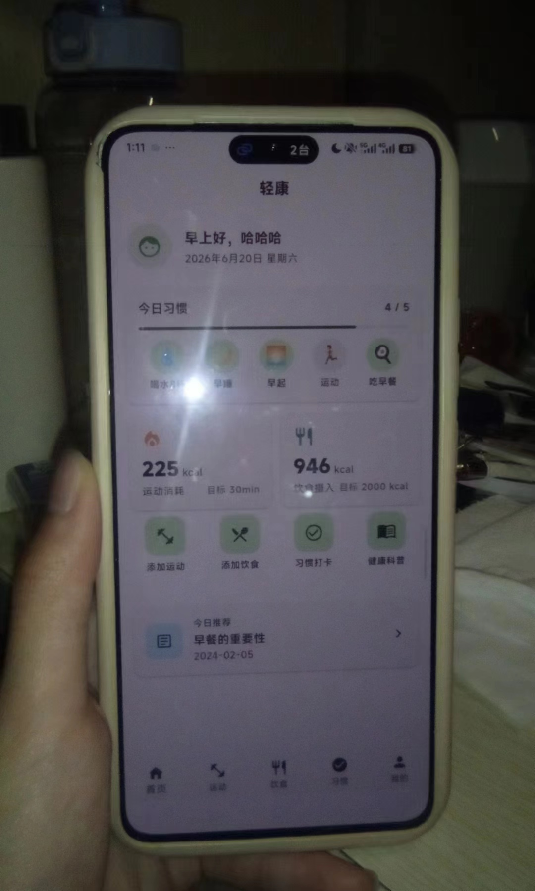
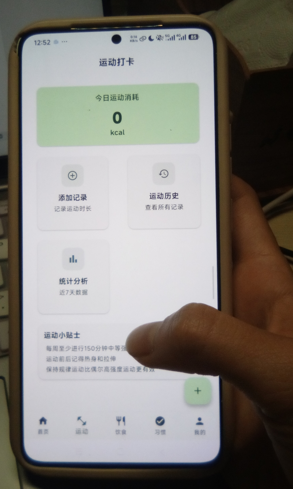
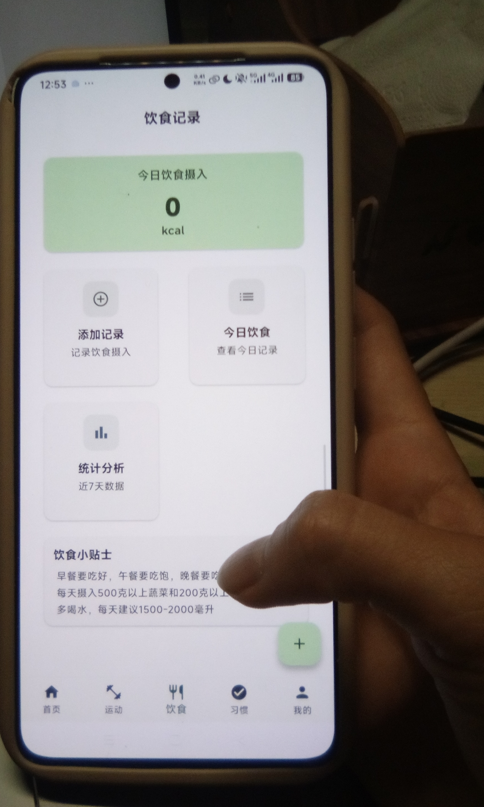
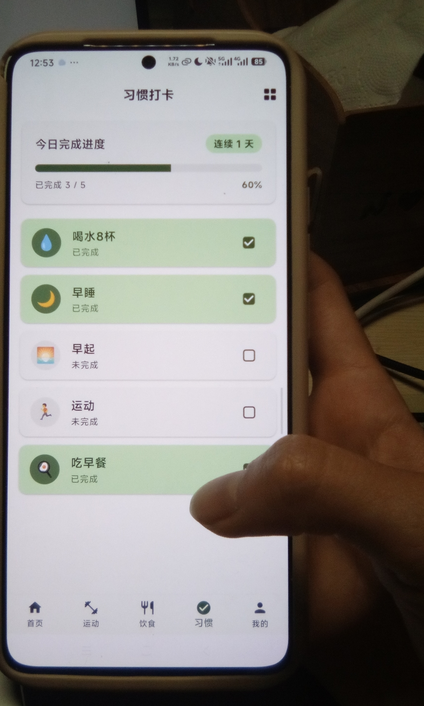
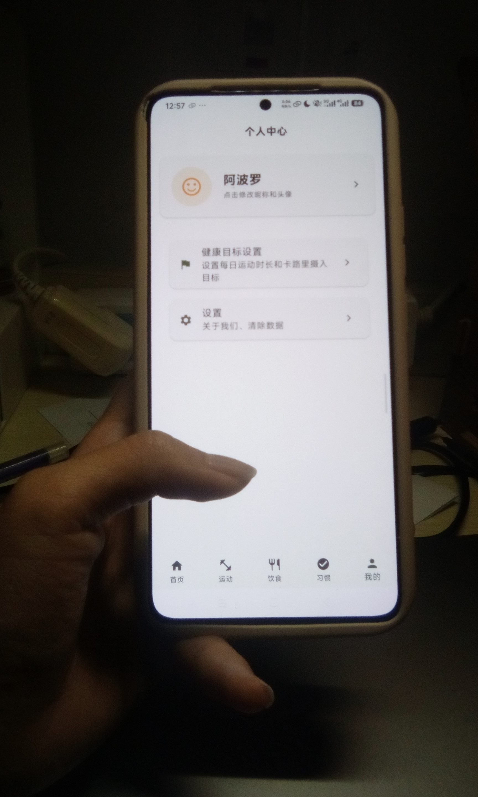

# 「轻康」健康生活打卡APP

----------------------------------------

## 项目简介
本项目是移动应用实训课程的期末小组作业，面向大学生群体的轻量化健康管理工具，基于 Flutter 跨平台开发，核心覆盖**运动打卡、饮食记录、习惯打卡、健康科普**四大功能，同时具备：完整的多页面交互、真实远程数据加载、规范的 Git 版本管理、完整的实验报告与思政内容。

## 🎯 实验目标
| 目标类型 | 描述 |
| -------- | ---- |
| 协作目标 | 掌握 GitHub Fork + Pull Request 多人协作流程 |
| 技术目标 | 熟悉 Flutter 开发环境配置、远程数据加载与 Android 真机调试 |
| 验证目标 | 通过真机运行照片证明协作成果的真实性 |
| 思政目标 | 数据来源权威可查，用户隐私保护，培养健康生活意识 |

## 📋 实验背景
在软件开发过程中，多人协作和真机测试是保证产品质量的关键环节。本项目要求：
* 7人小组通过 GitHub 进行代码协作
* 使用真实 Android 设备进行应用测试
* 远程数据加载（非本地捏造），来源权威可查
* 提供有效的真机运行证据

----------------------------------------

## 实验概述
### 实验主题
「轻康」健康生活打卡APP — GitHub 多人协作与 Flutter Android 真机运行

### 核心目标
完成一个包含运动打卡、饮食记录、习惯打卡、健康科普四大功能的 Flutter 健康管理应用，7人分工协作开发，最终部署到真实 Android 手机运行验证。

### 技术栈
| 分类 | 技术 | 版本/说明 |
| ---- | ---- | -------- |
| 开发框架 | Flutter | ^3.12.0 |
| 编程语言 | Dart | ^3.11.0 |
| 网络请求 | dio | ^5.9.2 |
| 本地存储 | shared_preferences | ^2.5.5 |
| 图表可视化 | fl_chart | ^1.2.0 |
| UI 体系 | Material 3 官方组件 | 不引入第三方 UI 库 |
| 路由管理 | 命名路由 + 底部导航 | — |
| 版本控制 | Git / GitHub | — |
| 移动平台 | Android | API 24+ |

### 核心功能清单
1. **首页**：今日健康数据概览（习惯打卡进度、卡路里摄入/消耗、快捷功能入口）
2. **运动打卡**：添加运动记录、运动历史列表、近7天消耗统计柱状图
3. **饮食记录**：添加饮食记录、远程食物库选择、当日卡路里汇总、近7天摄入折线图
4. **习惯打卡**：5种预设习惯、当日打卡、连续打卡天数、周打卡视图
5. **健康科普**：科普文章列表、文章详情页（数据100%远程加载）
6. **个人中心**：昵称设置、预设头像选择、健康目标设定、设置页

### 远程数据方案
* 数据全部来自权威公开渠道：《中国食物成分表》、国家卫健委/中国营养学会公开科普、国民体质监测运动消耗标准
* 整理为3份标准 JSON 文件，托管在独立的 Gitee 公开数据仓库
* APP 端通过 dio 发起网络请求获取数据，支持下拉刷新

### 实验流程
1. 仓库初始化 → 2. 成员 Fork → 3. 分支开发 → 4. PR 提交 → 5. 代码审核 → 6. 合并 → 7. 真机运行 → 8. 证据收集

----------------------------------------

## 小组成员
| 序号 | 角色 | 分工任务 |
| ---- | ---- | -------- |
| 1 | 组长 | 架构搭建、首页开发、公共层封装、仓库管理、代码审核 |
| 2 | 数据层 | 真实数据搜集整理、Gitee数据仓库、Model类、Repository接口 |
| 3 | 个人中心 | 昵称设置、个人主页、健康目标、设置页 |
| 4 | 运动打卡 | 运动记录添加、历史列表、统计柱状图 |
| 5 | 饮食记录 | 饮食添加、食物选择、当日汇总、统计折线图 |
| 6 | 习惯打卡+科普 | 习惯打卡、周视图、科普列表、科普详情 |
| 7 | 文档与测试 | README文档、实验报告、功能测试、截图整理、演示准备 |

----------------------------------------

## 测试设备信息
### 硬件规格
| 参数 | 详情 |
| ---- | ---- |
| 设备名称 | Redmi K70 |
| 操作系统 | Android 16 (OS 3.0.9.0.WNKCNXM) |
| 处理器 | 第二代骁龙®8移动平台 八核 最高 3.19GHz |
| 运行内存 | 16.0 GB |
| 存储空间 | 512 GB (可用 302.8 GB) |
| 屏幕尺寸 | 6.67 英寸 |
| 分辨率 | 3200 × 1440 |
| 电池容量 | 5000 mAh |
| 摄像头 | 前置 16MP / 后置 50+8+2 MP |

----------------------------------------

## 项目结构
```
qk-app/
├── android/                        # Android 原生代码目录
├── ios/                            # iOS 原生代码目录
├── lib/                            # Flutter Dart 代码目录
│   ├── main.dart                   # 应用入口（勿改）
│   ├── app.dart                    # MaterialApp + 路由 + 底部导航（勿改）
│   ├── config/
│   │   ├── theme.dart              # Material 3 主题（勿改）
│   │   ├── routes.dart             # 命名路由常量（按需引用）
│   │   └── constants.dart          # 全局常量（按需引用）
│   ├── services/
│   │   ├── http_util.dart          # 网络工具（直接调用）
│   │   └── storage_util.dart       # 本地存储封装（直接调用）
│   ├── models/                     # 数据模型（角色2）
│   ├── repositories/               # 数据仓库接口（角色2）
│   ├── pages/
│   │   ├── home/                   # 首页（组长）
│   │   ├── exercise/               # 运动打卡（角色4）
│   │   ├── diet/                   # 饮食记录（角色5）
│   │   ├── habit/                  # 习惯打卡（角色6）
│   │   ├── knowledge/              # 健康科普（角色6）
│   │   └── profile/                # 个人中心（角色3）
│   └── widgets/                    # 公共组件（直接使用）
│       ├── common_app_bar.dart
│       ├── loading_widget.dart
│       ├── empty_state_widget.dart
│       └── common_list_tile.dart
├── test/                           # 测试代码目录
├── web/                            # Web 平台代码
├── windows/                        # Windows 平台代码
├── linux/                          # Linux 平台代码
├── macos/                          # macOS 平台代码
├── .gitignore                      # Git 忽略配置
├── analysis_options.yaml           # 代码分析配置
├── pubspec.yaml                    # Flutter 项目配置
├── pubspec.lock                    # 依赖版本锁定文件
└── README.md                       # 项目说明文档
```

----------------------------------------

## 环境要求
### 开发环境配置
| 软件 | 版本要求 | 说明 |
| ---- | -------- | ---- |
| Flutter SDK | >= 3.12.0 | 官方稳定版 |
| Dart SDK | >= 3.11.0 | Flutter 内置 |
| Android Studio | >= Hedgehog | 推荐版本 |
| JDK | >= 17 | 开发工具包 |
| Android SDK | >= API 24 | 目标平台版本 |

### 环境变量配置
```bash
# Windows 环境变量示例
FLUTTER_HOME = <你的Flutter SDK路径>
ANDROID_HOME = <你的Android SDK路径>
PATH += %FLUTTER_HOME%\bin;%ANDROID_HOME%\platform-tools
```

### 验证环境配置
```bash
# 验证 Flutter 版本
flutter --version

# 验证 Dart 版本
dart --version

# 检查环境是否就绪
flutter doctor

# 检查 Android 设备连接
adb devices

# 检查 Flutter 设备识别
flutter devices
```

----------------------------------------

## 开发工具箱（组长已封装，直接使用）

### 1. 页面跳转 — 命名路由

所有路由常量定义在 `config/routes.dart`，跳转时直接引用：

```dart
import 'package:qk/config/routes.dart';

// 跳转到指定页面
Navigator.pushNamed(context, AppRoutes.exerciseAdd);

// 返回上一页
Navigator.pop(context);
```

| 路由常量 | 对应页面 | 负责角色 |
|---|---|---|
| `AppRoutes.home` | 首页 | 组长 |
| `AppRoutes.exerciseAdd` | 添加运动记录 | 角色4 |
| `AppRoutes.exerciseHistory` | 运动历史 | 角色4 |
| `AppRoutes.exerciseStats` | 运动统计 | 角色4 |
| `AppRoutes.dietAdd` | 添加饮食记录 | 角色5 |
| `AppRoutes.dietFoodSelect` | 选择食物 | 角色5 |
| `AppRoutes.dietToday` | 今日饮食 | 角色5 |
| `AppRoutes.dietStats` | 饮食统计 | 角色5 |
| `AppRoutes.habit` | 习惯打卡 | 角色6 |
| `AppRoutes.habitWeekly` | 周打卡视图 | 角色6 |
| `AppRoutes.knowledgeList` | 科普列表 | 角色6 |
| `AppRoutes.knowledgeDetail` | 科普详情 | 角色6 |
| `AppRoutes.profile` | 个人中心 | 角色3 |
| `AppRoutes.profileNickname` | 昵称设置 | 角色3 |
| `AppRoutes.profileGoal` | 健康目标 | 角色3 |
| `AppRoutes.profileSettings` | 设置 | 角色3 |

### 2. 网络请求 — HttpUtil

```dart
import 'package:qk/services/http_util.dart';

// 获取列表数据（自动处理异常，失败返回空列表）
List<dynamic> data = await HttpUtil().getList('https://xxx.json');

// 获取单个对象
Map<String, dynamic>? obj = await HttpUtil().getMap('https://xxx.json');
```

> ⚠️ 不要自己 `new Dio()`，统一使用 `HttpUtil()`。

### 3. 本地存储 — StorageUtil

```dart
import 'package:qk/services/storage_util.dart';

// 保存
await StorageUtil().saveString('nickname', '小明');
await StorageUtil().saveInt('goal_calories', 2000);
await StorageUtil().saveBool('first_launch', false);

// 读取
String? name = StorageUtil().getString('nickname');
int? goal = StorageUtil().getInt('goal_calories');

// 删除 / 清空
await StorageUtil().remove('nickname');
await StorageUtil().clearAll();
```

> ⚠️ Key 命名规范：`模块_含义`，如 `exercise_records`、`diet_today`、`habit_check_日期`。

### 4. 公共UI组件

```dart
import 'package:qk/widgets/common_app_bar.dart';
import 'package:qk/widgets/loading_widget.dart';
import 'package:qk/widgets/empty_state_widget.dart';
import 'package:qk/widgets/common_list_tile.dart';

// 统一顶部栏
CommonAppBar(title: '运动打卡')

// 加载中
LoadingWidget(message: '正在加载数据...')

// 空数据占位
EmptyStateWidget(
  icon: Icons.fitness_center,
  message: '还没有运动记录',
  actionLabel: '添加记录',
  onAction: () => Navigator.pushNamed(context, AppRoutes.exerciseAdd),
)

// 统一列表项
CommonListTile(
  leading: Icon(Icons.directions_run),
  title: '跑步',
  subtitle: '30分钟 · 消耗200kcal',
  onTap: () {},
)
```

### 5. 全局常量

```dart
import 'package:qk/config/constants.dart';

// 应用名称
AppConstants.appName
// 预设习惯列表
AppConstants.presetHabits
// 数据URL（角色2用）
AppConstants.foodsUrl / AppConstants.sportsUrl / AppConstants.articlesUrl
```

----------------------------------------

## 开发规范

### 命名规范
| 类型 | 规范 | 示例 |
|---|---|---|
| 文件 | `snake_case` | `home_page.dart` |
| 类 | `PascalCase` | `HomePage` |
| 变量/方法 | `camelCase` | `todayCalories` |
| 常量 | `camelCase` | `dataRepoBaseUrl` |
| 存储Key | `模块_含义` | `exercise_records` |

### 代码风格
- 关键位置加基础注释（类说明、方法用途）
- 优先保证功能跑通，UI 不过度美化
- 禁止私自添加方案外的第三方依赖
- 统一使用 `StatefulWidget` + `setState`，不引入状态管理库

----------------------------------------

## ANDROID 真机运行步骤
### 📱 手机端配置
1. 打开设置 → 关于手机
2. 连续点击 **版本号** 7次，开启开发者选项
3. 返回设置，进入 **系统和更新** → **开发者选项**
4. 开启 **USB调试** 开关
5. 使用数据线连接手机到电脑
6. 在手机上弹出的授权对话框中点击 **允许**

### 💻 电脑端操作
```bash
# 步骤 1: 检查设备连接
adb devices
# 预期输出: List of devices attached
#           1234567890ABCDEF    device

# 步骤 2: 确认 Flutter 识别设备
flutter devices
# 预期输出: 列出已连接的 Android 设备

# 步骤 3: 进入项目目录
cd qk-app

# 步骤 4: 获取依赖
flutter pub get

# 步骤 5: 运行应用到真机
flutter run
```

### 📝 运行日志说明
```bash
# 成功运行时的日志信息
Launching lib/main.dart on XXX in debug mode...
Running Gradle task 'assembleDebug'...
✓ Built build/app/outputs/flutter-apk/app-debug.apk.
Installing build/app/outputs/flutter-apk/app.apk...
Waiting for XXX to report its views...
Syncing files to device XXX...
```

----------------------------------------

## GITHUB 协作流程
### 🔀 FORK 流程
1. 访问原始仓库：`https://github.com/primer496/qk-app`
2. 点击右上角 **Fork** 按钮
3. 等待 Fork 完成，进入个人仓库

### 🔧 本地开发
```bash
# 克隆个人仓库
git clone https://github.com/<你的用户名>/qk-app.git

# 进入项目目录
cd qk-app

# 添加上游仓库
git remote add upstream https://github.com/primer496/qk-app.git

# 创建个人开发分支
git checkout -b dev-<姓名拼音>

# 开发完成后提交
git add .
git commit -m "feat: 完成XXX功能"

# 推送分支到个人仓库
git push origin dev-<姓名拼音>
```

### 📤 PULL REQUEST 流程
1. 访问个人仓库的 GitHub 页面
2. 切换到已推送的开发分支
3. 点击 **Compare & pull request**
4. 填写 PR 标题和描述
5. 指定组长作为审核人
6. 提交 PR 等待审核

### ✅ 审核与合并
1. 组长收到 PR 通知
2. 审核代码内容
3. 提出修改意见（如需要）
4. 审核通过后点击 **Merge pull request**
5. 删除特性分支

### Git 提交规范
```
feat: 新功能描述
fix: 修复xxx问题
docs: 更新文档
refactor: 重构xxx
```

### Git 协作规则
1. 从 `main` 创建自己的分支：`dev-姓名拼音`
2. 在个人分支上开发，**只修改自己负责的模块目录**
3. 开发完成自测通过 → 推送个人分支 → 告知组长合并
4. 每次开始写代码前，先拉取最新的 `main` 分支代码
5. 修改公共文件（config/services/widgets）必须先和组长沟通

----------------------------------------

## 运行项目
### 基础命令
```bash
# 克隆项目
git clone https://github.com/primer496/qk-app.git

# 进入项目目录
cd qk-app

# 安装依赖
flutter pub get

# 运行应用（连接真机后）
flutter run

# 构建 APK（release 版本）
flutter build apk --release

# 构建 App Bundle
flutter build appbundle
```

### 运行参数说明
| 参数 | 说明 | 示例 |
| ---- | ---- | ---- |
| `--debug` | 调试模式（默认） | `flutter run --debug` |
| `--release` | 发布模式 | `flutter run --release` |
| `--profile` | 性能分析模式 | `flutter run --profile` |
| `-d <device-id>` | 指定设备运行 | `flutter run -d 12345678` |
| `--hot` | 热重载模式 | `flutter run --hot` |

----------------------------------------

## 实验证据说明
### 📸 证据要求
| 要求 | 说明 | 是否符合 |
| ---- | ---- | -------- |
| 禁止 Web 截图 | 不能提交浏览器或网页截图 | ✅ |
| 禁止模拟器截图 | 必须使用真实设备 | ✅ |
| 禁止手机截图 | 不能使用手机自带截图功能 | ✅ |
| 必须手持拍摄 | 使用第二部手机拍摄手持真机的照片 | ✅ |
| 清晰展示界面 | 照片需清晰显示应用运行界面 | ✅ |

### 📋 证据标准
1. **真实性**：必须是真实设备运行的照片
2. **完整性**：需拍到手持手机的场景
3. **清晰度**：应用界面文字清晰可读
4. **唯一性**：每张照片展示不同功能页面

### 📷 真机运行照片

| 截图 | 页面 |
|------|------|
|  | 首页 |
|  | 运动打卡 |
| .jpg) | 运动打卡（2） |
| .jpg) | 运动打卡（3） |
|  | 饮食记录 |
| .jpg) | 饮食记录（2） |
| .jpg) | 饮食记录（3） |
|  | 习惯打卡 |
|  | 设置页 |
| .jpg) | 设置页（2） |
| .jpg) | 设置页（3） |

> 以上截图均为 Redmi K70 真机运行照片，手持拍摄，符合课程证据要求。

### 🎬 真机运行演示视频

[▶️ 点击观看演示视频](video/7642ab32ac54c16a24bdf4703198e490.mp4)

----------------------------------------

## 开发过程中遇到的困难与解决方案

> 记录项目集成阶段发现的Bug、功能缺口及修复过程。

### 1. Hero 标签冲突导致应用崩溃

**现象**：应用启动后抛出异常 `There are multiple heroes that share the same tag within a subtree`。

**原因**：`MainShell` 使用 `IndexedStack` 保持所有Tab页面同时存活，各子页面的 `FloatingActionButton` 均未指定 `heroTag`。

**解决方案**：为每个 `FloatingActionButton` 添加唯一 `heroTag`（如 `exercise_add`、`diet_add` 等）。

**经验**：`IndexedStack` 中使用 `FloatingActionButton` 必须显式指定 `heroTag`。

---

### 2. 数据变更后其他页面不刷新

**现象**：运动/饮食/习惯模块增删记录后，首页卡路里数据和习惯进度不自动更新。

**原因**：各模块 Service 层只有数据读写，无通知机制。

**解决方案**：在 `ExerciseService`、`DietService`、`HabitStorageUtil` 中分别添加 `static final ValueNotifier<int> changeNotifier`，修改操作后 `changeNotifier.value++`，首页及其他页面 `addListener` 自动刷新。

**经验**：`ValueNotifier` + `addListener` 是零依赖、极简的跨页面通信方案。

---

### 3. 健康目标设置后无反馈

**现象**：用户在「健康目标设置」中设定目标后，首页没有任何展示。

**原因**：`goal_setting.dart` 通过 `StorageUtil` 存储了目标值，但全项目无任何地方读取。

**解决方案**：在首页 `_loadUserData` 中读取目标值，在卡路里概览卡片中展示目标对比。

**经验**：功能闭环 = 设置 → 存储 → 读取 → 展示，缺一不可。

---

### 4. 首页科普推荐为硬编码假数据

**现象**：首页「今日推荐」科普卡片始终显示固定内容，不满足「数据100%远程加载」要求。

**原因**：首页的 `_todayArticle` 是写死的 `Map<String, String>`。

**解决方案**：引入 `ArticleRepository`，异步加载远程文章列表并随机选取一篇展示，点击跳转到文章详情页。

---

### 5. 手机端底部溢出

**现象**：运动模块和饮食模块首页底部出现 `BOTTOM OVERFLOWED BY 12 PIXELS`。

**原因**：顶部热量卡片 + GridView + 底部小贴士卡片 + FAB 累积高度超出屏幕。

**解决方案**：微调间距参数压缩总高度约60px：`childAspectRatio` 1.2→1.1、间距12→10、padding调整等。

**经验**：`IndexedStack` + 多内容页面的场景应在开发阶段用小屏模拟器测试。

---

### 6. 遗留占位文件未清理

**现象**：`knowledge_placeholder.dart` 和 `profile_placeholder.dart` 在路由中已被真实页面替换，文件仍残留在磁盘上。

**解决方案**：直接删除两个占位文件。

---

### 7. PR合并后源文件全部位于根目录

**现象**：角色4完成的运动打卡模块PR合并后，App完全没有运动功能。Git显示1608行代码已合并，但行为无变化。

**原因**：PR中所有11个 `.dart` 文件被放在项目根目录，而Flutter只编译 `lib/` 目录下的文件。

**排查过程**：`git show --stat` 发现文件均在根目录，`git ls-tree -r HEAD` 确认为 `lib/` 下无对应文件。

**解决方案**：将11个文件手动迁移至 `lib/` 对应位置，4个冲突文件（`app.dart`、`home_page.dart`、`sport.dart`、`sport_repository.dart`）以PR版本覆盖。

**经验**：Flutter 所有 Dart 源码必须位于 `lib/` 目录；PR合并后应立即 `flutter run` 验证。

---

### 8. 远程数据加载失败 — Gitee Raw接口与Dio类型系统不兼容

**现象**：运动类型下拉框为空，报错 `type 'String' is not a subtype of type 'List<dynamic>?'` 和 `FormatException: Unexpected character`。

**原因链**：
1. Gitee Raw 接口返回 `Content-Type: text/plain`，Dio 默认不解析
2. `get<List<dynamic>>` 泛型类型强转失败
3. Gitee 响应含 UTF-8 BOM (`\uFEFF`)，`jsonDecode` 抛出异常

**解决方案（三轮迭代）**：
| 轮次 | 尝试 | 结果 |
|------|------|------|
| 1 | 加 `responseType: ResponseType.json` | ❌ 泛型强转仍失败 |
| 2 | `get<String>` + `jsonDecode` | ❌ BOM头导致FormatException |
| 3 | `get<String>` + `ResponseType.plain` + BOM剥离 + `jsonDecode` | ✅ 成功 |

最终核心逻辑：
```dart
final response = await _dio.get<String>(url,
  options: Options(responseType: ResponseType.plain));
var body = response.data!;
if (body.codeUnitAt(0) == 0xFEFF) { body = body.substring(1); }
final decoded = jsonDecode(body);
```

**经验**：不信任第三方 Content-Type，用 `ResponseType.plain` 获取原始字符串再手动解析；`jsonDecode` 不会自动处理 BOM。

---

### 9. 角色4跨模块越界修改

**现象**：角色4提交运动打卡模块时额外修改了角色2的 `sport.dart` 和 `sport_repository.dart`。

**影响**：`sport_repository.dart` 的 mock_data 兜底掩盖了 HttpUtil 的远程加载Bug（见第8条）。

**解决方案**：保留 `sport.dart` 的 `==`/`hashCode` 增强改动；回退 `sport_repository.dart` 至角色2原版；清理根目录残留文件。

**经验**：严格按分工边界开发，不碰他人模块文件；兜底逻辑会掩盖真实Bug，延误修复时机。

---

### 团队规范要点（根据踩坑提炼）
1. 所有 Dart 源码必须放在 `lib/` 目录对应子目录下
2. 禁止跨模块修改他人代码
3. PR前先同步 main 分支，跑通 `flutter analyze`
4. 不要用 mock 数据掩盖真实问题
5. 网络层使用 `ResponseType.plain` + 手动解析，不信任第三方 Content-Type

----------------------------------------

## 移动端适配说明

### 触摸热区
| 元素 | 尺寸 | 标准 | 状态 |
|---|---|---|---|
| 快捷功能图标 | 52×52dp | ≥48dp | ✅ 达标 |
| 习惯打卡圆圈 | 44×44dp | ≥48dp | ⚠️ 略小，建议后续调至48 |
| 底部导航项 | 系统默认 | ≥48dp | ✅ 达标 |
| 列表项 | 系统默认 | ≥48dp | ✅ 达标 |

### 屏幕适配
- 4列快捷功能网格在 **360dp 及以上**屏幕（主流手机）显示正常
- 320dp 窄屏（如 iPhone SE 1代）文字可能偏紧，可接受
- 卡片水平边距 16dp — 移动端标准间距
- 使用 `ListView` + `RefreshIndicator` — 原生下拉刷新体验

### 页面架构
```
Scaffold (MainShell，提供底部导航)
  └── IndexedStack（保持Tab状态不丢失）
        ├── HomePage 的 Scaffold（提供首页顶部栏）
        ├── 运动页 的 Scaffold（提供运动页顶部栏）
        ├── 饮食页 的 Scaffold
        ├── 习惯页 的 Scaffold
        └── 我的页 的 Scaffold
```

> 💡 每个Tab页面有自己的 `Scaffold` + `AppBar`，外层共用底部导航栏。这是 Flutter 官方推荐的多Tab架构，确保各页面独立且状态保持。

----------------------------------------

## 交付物清单
| 角色 | 交付物 |
| ---- | ------ |
| 组长 | 项目基础框架工程、公共组件库、网络工具类、路由配置、全局主题、首页完整页面代码、Gitee主代码仓库 |
| 数据层 | Gitee数据仓库 + 3份标准JSON文件 + 访问URL、所有数据Model类代码、各模块数据Repository接口代码、数据来源说明文档 |
| 个人中心 | 昵称设置页、个人中心主页、目标设置页、设置页（共4页面代码）、用户数据本地存取逻辑 |
| 运动打卡 | 运动记录添加页、运动历史列表页、运动统计页（共3页面代码）、运动记录本地增删改查、首页当日数据获取方法 |
| 饮食记录 | 饮食添加页、食物选择页、当日饮食列表页、饮食统计页（共4页面代码）、饮食记录增删改查、卡路里自动计算、首页当日数据获取方法 |
| 习惯打卡+科普 | 打卡主页、周视图页、科普列表页、科普详情页（共4页面代码）、习惯打卡本地存取、连续打卡天数计算、首页当日打卡进度获取方法 |
| 文档与测试 | 期末实验报告（Word版）、功能草图/页面流程图、测试Bug清单 + 测试记录、分类整理的全页面运行截图包、主仓库README.md、演示流程与答辩话术 |

----------------------------------------

## 附录
### 📚 数据来源
| 数据类型 | 来源 | 说明 |
| -------- | ---- | ---- |
| 食物营养数据 | 《中国食物成分表》 | 50种常见食物，含卡路里/分类 |
| 运动消耗数据 | 国民体质监测标准 | 10种常见运动，含每小时消耗 |
| 健康科普文章 | 国家卫健委/中国营养学会 | 10-15篇公开科普内容 |

### 📚 参考资源
* Flutter 官方文档：https://docs.flutter.dev
* Material 3 设计指南：https://m3.material.io
* dio 网络库：https://pub.dev/packages/dio
* fl_chart 图表库：https://pub.dev/packages/fl_chart
* shared_preferences：https://pub.dev/packages/shared_preferences
* GitHub 协作指南：https://docs.github.com/pull-requests
* ADB 命令参考：https://developer.android.com/tools/adb

### 📞 联系方式
如有问题，请联系组长或相关组员。

----------------------------------------

项目完成日期：2026年6月
